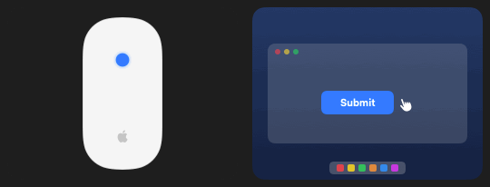
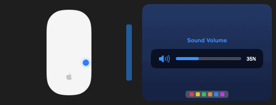
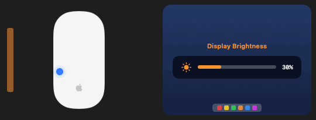
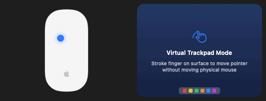
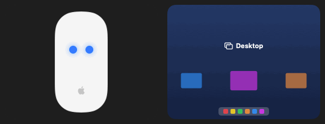
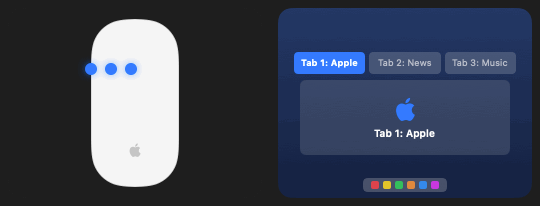
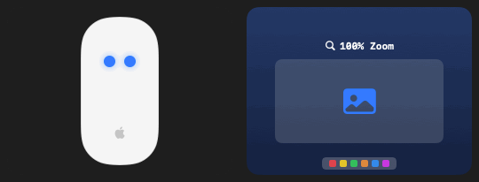
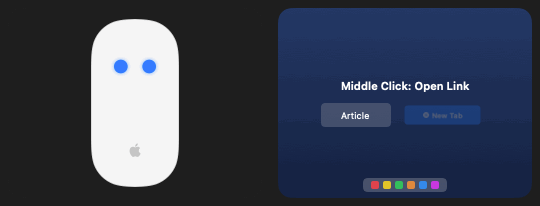

# 🪄 MagicGlide

<p align="center">
  <strong>Supercharge your Apple Magic Mouse into a gesture-packed, high-precision Trackpad powerhouse.</strong>
</p>

<p align="center">
  <a href="#-english"><strong>🇬🇧 English</strong></a> • 
  <a href="#-tiếng-việt"><strong>🇻🇳 Tiếng Việt</strong></a>
</p>

<p align="center">
  <em>👉 <strong>Bạn đọc Việt Nam:</strong> Kéo xuống dưới hoặc <a href="#-tiếng-việt"><strong>bấm vào đây để xem bản Tiếng Việt</strong></a>.</em>
</p>

<p align="center">
  
  
  
</p>

---

<a name="-english"></a>
# 🇬🇧 English

> 💡 **Dành cho bạn đọc Việt Nam:** Phần tài liệu và hướng dẫn đầy đủ bằng **Tiếng Việt** nằm ở nửa dưới của trang. Bạn có thể [bấm vào đây để nhảy xuống phần Tiếng Việt ngay ➔](#-tiếng-việt)

## 🌟 Why MagicGlide?

The Apple Magic Mouse has iconic hardware and a capacitive multi-touch surface, yet out-of-the-box macOS treats it like a basic mouse with stiff scrolling. **MagicGlide** unlocks the true potential of your Magic Mouse:

- **No more stiff clicking:** Enjoy silky tap-to-click just like on a MacBook trackpad.
- **Edge Volume & Brightness:** Slide your finger along the left or right rail for instant system volume and display brightness adjustments with native Apple OSD bezels.
- **Virtual Trackpad Mode:** Transform your mouse into a stationary desk trackpad. Steer the cursor with 1 finger on the surface, click by tapping, and scroll smoothly with 2 fingers.
- **Effortless Window Control:** Swipe up for Mission Control, and swipe down to smoothly dismiss back to desktop.
- **4-Layer False-Positive Defense:** Advanced palm rest rejection, grip filter, and momentum veto ensure your gestures trigger only when you want them to.

---

## ✨ Features Overview

| Feature | Gesture | Action / Details | Default Status |
| :--- | :--- | :--- | :--- |
| **Tap to Click** | ☝️ 1-Finger Tap | Left-click on left side, Right-click on right side (customizable split zone). | ✅ Enabled |
| **Physical 2-Finger Click** | ✌️ Press down with 2 fingers | Mechanical switch press transforms to Middle-Click or customizable action. | ✅ Enabled |
| **Brightness Control** | 💡 Slide Left Edge | Smoothly control Mac display brightness with native Apple OSD. | ✅ Enabled |
| **Volume Control** | 🎛️ Slide Right Edge | Adjust system volume up/down with native Apple floating bezel. | ✅ Enabled |
| **Mission Control** | ⬆️ 2-Finger Swipe Up | Opens Mission Control overview. | ✅ Enabled |
| **Contextual Dismissal** | ⬇️ 2-Finger Swipe Down | Closes Mission Control and returns to normal desktop. | ✅ Enabled |
| **Tab Scrubbing** | 🖐️ 3-Finger Horizontal Slide | Fluidly cycle through Safari, Chrome, or VS Code tabs like a jog wheel. | ✅ Enabled |
| **Pinch-to-Zoom** | 🤏 2-Finger Pinch | Real-time native magnification zoom. | ✅ Enabled |
| **Virtual Trackpad Mode** | 3-Finger Tap / Hotkey | Mouse stays stationary; 1-finger moves pointer, 2-finger scrolls with inertia. | ⚙️ Optional in Settings |
| **Move-to-Zoom** | ↕️ Hold 2 fingers & push mouse | Cursor freezes in place while physical mouse displacement zooms in/out. | ⚙️ Optional in Settings |
| **Drag Lock / Tap** | ✌️ 2-Finger Tap | Locks mouse down for easy window dragging; tap again to release. | ⚙️ Optional in Settings |

---

## 🎬 Visual Feature Showcase

### 1. 🖱️ Tap-to-Click & Right-Click Zone
Tap gently anywhere on the mouse glass surface without pressing down the mechanical switch.
<p align="center">
  
</p>

### 2. 🎛️ Dual Edge Sliders (Volume & Brightness)
Slide your finger along the right rail for system volume and left rail for display brightness with native Apple OSD bezels.
<p align="center">
  
  
</p>

### 3. 💻 Virtual Trackpad Mode
Converts your mouse into a stationary desk trackpad. Steer pointer with 1 finger, scroll smoothly with 2 fingers, and tap to click.
<p align="center">
  
</p>

### 4. 🪟 Mission Control & Contextual Return
Swipe up to reveal Mission Control overview, swipe down to pull windows back down to normal desktop.
<p align="center">
  
</p>

### 5. 📑 Continuous 3-Finger Tab Scrubbing
Fluidly cycle through browser or editor tabs like a jog wheel.
<p align="center">
  
</p>

### 6. 🔍 Dual Zoom Engines (Pinch-to-Zoom & Move-to-Zoom)
Pinch with 2 fingers or push/pull mouse forward/backward while freezing the cursor in place.
<p align="center">
  
</p>

### 7. ✌️ 2-Finger Physical Click (Middle Click)
Physically press down the mouse switch with 2 fingers touching to open links in background tabs.
<p align="center">
  
</p>

---

## 🛡️ 4-Layer False-Trigger Defense System

To prevent accidental clicks and unintended gesture activations while resting your hand or scrolling:

1. **Palm & Grip Rejection:** Automatically rejects palm contacts at the rear base (Y < 0.18) and thumb/pinky grips along the outer edges.
2. **Symmetry & Direction Validation:** Multi-finger swipes require all fingers to travel in parallel with consistent displacement ratios.
3. **Momentum & Scroll Veto:** Tap and click synthesizers are temporarily guarded during active scrolling and inertia deceleration.
4. **Context-Aware Dismissal:** Downward swipes inside Mission Control intelligently close Mission Control rather than misfiring secondary actions.

---

## 🚀 Installation & Quick Start

### Option 1: Download DMG Installer (Recommended)

1. Download `MagicGlide.dmg` from the [Releases](https://github.com/nguyenvanbao1904/MagicGlide/releases) page.
2. Double-click the downloaded `.dmg` file.
3. Simply drag **MagicGlide.app** into the **Applications** folder shortcut.
4. Open **MagicGlide** from Applications.
5. When prompted, grant **Accessibility** permissions:
   - Go to **System Settings → Privacy & Security → Accessibility**.
   - Toggle **MagicGlide** to **ON** ✓.

> [!IMPORTANT]
> ### ⚠️ First-Time Launch on macOS (Apple Gatekeeper)
> Since MagicGlide is a free open-source project without a paid $99/year Apple Developer Certificate, macOS Gatekeeper may show: *"Apple cannot verify that MagicGlide is free of malware"*.
>
> **Quick solutions (only needed on the very first launch):**
> - **macOS 27 Golden Gate, macOS 26 Tahoe, macOS 15 Sequoia:**
>   1. Click **Done** on the alert.
>   2. Go to **System Settings  → Privacy & Security**.
>   3. Scroll down to the **Security** section and click **Open Anyway** next to MagicGlide.
> - **macOS 14 Sonoma, macOS 13 Ventura & earlier:**
>   - Right-click (or Control-click) `MagicGlide.app` in `/Applications` ➔ Select **Open** ➔ Click **Open** in the dialog.
> - **Or quick launch via Terminal (Bypasses Gatekeeper and launches the app):**
>   ```bash
>   xattr -cr /Applications/MagicGlide.app && open /Applications/MagicGlide.app
>   ```

### Option 2: Build From Source

> 💡 **Note:** If you use **Option 1 (DMG download)**, you do **NOT** need Xcode or Command Line Tools at all. This section is strictly for developers who want to compile manually from source code.

Requirements: macOS 11.0+ and Xcode Command Line Tools (`xcode-select --install`).

```bash
# Clone the repository
git clone https://github.com/nguyenvanbao1904/MagicGlide.git
cd MagicGlide

# Run the automated test suite (51 unit tests)
./Scripts/run_tests.sh

# Build Universal Binary (Apple Silicon + Intel) with ad-hoc signing
./build.sh

# Optional: Package into MagicGlide.dmg installer
./create_dmg.sh

# Launch the app
open build/MagicGlide.app
```

---

## ⚙️ Configuration & Settings

MagicGlide comes out of the box with safe, production-grade defaults (Tap-to-click, physical 2-finger click for middle-click, edge sliders for Brightness & Volume, and 2-finger swipe for Mission Control). To guarantee zero interference with standard daily clicking and scrolling, gestures such as 2-finger tap, 3-finger tap, and move-to-zoom are disabled by default.

Click the **MagicGlide** icon in your macOS menu bar and open **Settings** to freely explore and tailor every gesture:
- **Interactive Visual Mouse Canvas:** Watch real-time touch points and gesture preview animations right on a 3D Magic Mouse model.
- **Full Gesture Rebinding:** Freely map any slot (Middle Click, Mission Control, App Exposé, Show Desktop, Smart Zoom, Virtual Trackpad Mode, Drag Lock, Tab Switching).
- **Edge Sliders Customization:** Choose actions for Left Edge (Brightness) and Right Edge (Volume), and adjust the edge activation width (15% to 28%).
- **Sensitivity & Split Zones:** Fine-tune tap sensitivity (Lenient / Medium / Strict) and slide the dividing boundary between Left-Click and Right-Click zones.
- **Bilingual Interface:** Instant live switch between **English** and **Tiếng Việt**.

---

## ❓ Troubleshooting

- **Taps aren't registering:** Check **System Settings → Privacy & Security → Accessibility**. Remove and re-add `MagicGlide.app` if you recently rebuilt the binary.
- **Mouse isn't detected:** Ensure your Magic Mouse is paired and connected via Bluetooth. MagicGlide monitors external Magic Mice and ignores built-in trackpads.
- **Scroll interference:** Virtual Trackpad Mode features native 2-finger scroll passthrough while eliminating 1-finger scroll jitter.

---

## ⭐ Support the Project

If **MagicGlide** makes your Magic Mouse experience better, please consider giving this repository a **Star** ⭐! It motivates future updates, helps other Mac users discover the project, and keeps it 100% free and open-source.

- 🌟 **Star this repo:** Click the **Star** button at the top-right of this GitHub page!
- 💡 **Feedback & Bug Reports:** Open an [Issue](https://github.com/nguyenvanbao1904/MagicGlide/issues) or submit a Pull Request.
- 📢 **Share:** Tell your friends or colleagues who use an Apple Magic Mouse!

---

<a name="-tiếng-việt"></a>
# 🇻🇳 Tiếng Việt

## 🌟 Tại sao bạn nên dùng MagicGlide?

Apple Magic Mouse sở hữu bề mặt cảm ứng đa điểm tuyệt đẹp, nhưng macOS mặc định lại thiếu đi rất nhiều cử chỉ tiện lợi. **MagicGlide** biến chiếc Magic Mouse của bạn thành một chiếc Trackpad thực thụ:

- **Chạm nhẹ là Click (Tap-to-Click):** Không cần bấm lún chuột cứng nhắc, chỉ cần chạm nhẹ ngón tay lên mặt kính để click chuột trái / chuột phải.
- **Vuốt mép chỉnh Âm lượng & Độ sáng:** Miết dọc theo cạnh viền trái hoặc phải của chuột để tăng/giảm âm lượng và độ sáng màn hình với giao diện OSD Apple chính chủ.
- **Chế độ Trackpad ảo (Virtual Trackpad Mode):** Biến chuột thành một bàn rê cố định trên bàn làm việc — miết 1 ngón di chuyển con trỏ, chạm 1 ngón để click, vuốt 2 ngón cuộn trang mượt mà có trượt quán tính.
- **Quản lý cửa sổ thông minh:** Vuốt lên mở Mission Control, vuốt xuống lập tức đóng Mission Control về lại màn hình bình thường.
- **Chống chạm nhầm 4 lớp:** Thuật toán lọc lòng bàn tay, mép ngón tay cái và ngón út giúp bạn yên tâm cầm chuột tự nhiên mà không lo nhảy cử chỉ bậy bạ.

---

## ✨ Bảng tóm tắt các tính năng

| Tính năng | Cử chỉ | Tác dụng | Trạng thái mặc định |
| :--- | :--- | :--- | :--- |
| **Chạm để Click** | ☝️ Chạm 1 ngón | Chạm bên trái là chuột trái, chạm bên phải là chuột phải (tự chỉnh tỷ lệ vùng). | ✅ Bật sẵn |
| **Bấm cơ 2 ngón** | ✌️ Bấm lún chuột khi đặt 2 ngón | Tự động chuyển thành nút chuột giữa (Middle Click) mở link tab mới. | ✅ Bật sẵn |
| **Chỉnh Độ sáng** | 💡 Miết mép trái | Tăng / giảm độ sáng màn hình trực tiếp với thanh OSD Apple. | ✅ Bật sẵn |
| **Chỉnh Âm lượng** | 🎛️ Miết mép phải | Tăng / giảm âm lượng máy tính kèm thanh hiển thị nổi macOS. | ✅ Bật sẵn |
| **Mở Mission Control** | ⬆️ Vuốt 2 ngón lên | Hiện tổng quan tất cả cửa sổ đang mở. | ✅ Bật sẵn |
| **Đóng về bình thường** | ⬇️ Vuốt 2 ngón xuống | Đóng Mission Control và quay về màn hình làm việc. | ✅ Bật sẵn |
| **Chuyển Tab liên tục** | 🖐️ Trượt ngang 3 ngón | Lướt qua lại giữa các tab trình duyệt (Safari, Chrome) hoặc file code. | ✅ Bật sẵn |
| **Thu phóng Pinch** | 🤏 Chụm / bung 2 ngón | Thu phóng nội dung (Pinch to Zoom) trực tiếp mượt mà. | ✅ Bật sẵn |
| **Trackpad ảo** | Chạm 3 ngón / Phím tắt | Chuột đứng yên; 1 ngón lái chuột, 2 ngón cuộn mượt mà chuẩn macOS. | ⚙️ Tùy chọn bật trong Cài đặt |
| **Move to Zoom** | ↕️ Giữ 2 ngón & đẩy chuột | Khóa con trỏ đứng yên, đẩy tới/kéo lui chuột để phóng to thu nhỏ. | ⚙️ Tùy chọn bật trong Cài đặt |
| **Khóa kéo (Drag Lock)**| ✌️ Chạm 2 ngón | Giữ chuột trái để kéo thả tài liệu không mỏi tay; chạm lại 2 ngón để nhả. | ⚙️ Tùy chọn bật trong Cài đặt |

---

## 🎬 Trình diễn tính năng trực quan (Demo GIFs)

### 1. 🖱️ Chạm để Click (Tap-to-Click) & Phân vùng Chuột phải
Chạm nhẹ lên mặt chuột là nhận click, không cần dùng lực bấm phím cơ.
<p align="center">
  
</p>

### 2. 🎛️ Vuốt mép chỉnh Âm lượng & Độ sáng (Dual Edge Sliders)
Miết ngón tay dọc viền mép phải để chỉnh âm lượng và mép trái để chỉnh độ sáng màn hình cực kỳ tiện lợi kèm OSD chính chủ Apple.
<p align="center">
  
  
</p>

### 3. 💻 Chế độ Trackpad ảo (Virtual Trackpad Mode)
Biến chuột thành bàn rê cố định: 1 ngón rê chuột, 2 ngón cuộn trượt quán tính, chạm nhẹ là click.
<p align="center">
  
</p>

### 4. 🪟 Mở & Đóng Mission Control ngữ cảnh
Vuốt 2 ngón lên mở Mission Control; khi đang ở Mission Control, vuốt 2 ngón xuống sẽ tự động thu cửa sổ về màn hình làm việc.
<p align="center">
  
</p>

### 5. 📑 Lướt chuyển Tab 3 ngón liên tục (Tab Scrubbing)
Trượt 3 ngón tay qua lại để chuyển đổi nhanh giữa các tab trình duyệt hoặc editor.
<p align="center">
  
</p>

### 6. 🔍 Thu phóng 2 ngón (Pinch Zoom & Move to Zoom)
Chụm bung 2 ngón hoặc giữ 2 ngón đẩy chuột để phóng to/thu nhỏ tài liệu.
<p align="center">
  
</p>

### 7. ✌️ Bấm cơ 2 ngón (Physical Click -> Middle Click)
Bấm lún phím chuột khi đặt 2 ngón để mở link tab mới (chuột giữa) hoặc action tùy chọn.
<p align="center">
  
</p>

---

## 🛡️ Hệ thống chống chạm nhầm 4 lớp

1. **Lọc lòng bàn tay & gờ cầm:** Bỏ qua các điểm chạm ở phần đuôi chuột (nơi tựa lòng bàn tay) và hai mép hông nơi ngón cái/ngón út tì vào để cầm chuột.
2. **Kiểm tra tính đồng hướng & đối xứng:** Cử chỉ vuốt đa ngón đòi hỏi các ngón tay phải di chuyển cùng hướng với biên độ tương đương.
3. **Scroll & Momentum Veto:** Tạm ngưng nhận diện click nhầm khi trang web đang cuộn nhanh hoặc đang trượt quán tính.
4. **Nhận biết ngữ cảnh:** Khi đang ở trong Mission Control, thao tác vuốt xuống sẽ luôn được ưu tiên để đóng Mission Control thay vì kích hoạt hành động khác.

---

## 🚀 Cài đặt & Hướng dẫn sử dụng

### Cách 1: Tải file DMG cài đặt (Khuyên dùng)

1. Tải file `MagicGlide.dmg` từ mục [Releases](https://github.com/nguyenvanbao1904/MagicGlide/releases).
2. Nhấp đúp mở file `.dmg` vừa tải về.
3. Kéo biểu tượng **MagicGlide.app** vào lối tắt thư mục **Applications** (Ứng dụng).
4. Mở **MagicGlide** từ Applications.
5. Cấp quyền **Trợ năng (Accessibility)** theo hướng dẫn trên màn hình:
   - Vào **Cài đặt hệ thống → Quyền riêng tư & Bảo mật → Trợ năng**.
   - Bật công tắc cho **MagicGlide** ✓.

> [!IMPORTANT]
> ### ⚠️ Lưu ý khi mở ứng dụng lần đầu (Cơ chế bảo vệ Apple Gatekeeper)
> Vì MagicGlide là phần mềm mã nguồn mở phi lợi nhuận (không đăng ký tài khoản Apple Developer $99/năm), macOS sẽ chặn mở lần đầu và báo: *"Apple không thể xác minh rằng MagicGlide không chứa phần mềm độc hại..."*.
>
> **Hướng dẫn mở ứng dụng (chỉ cần thực hiện 1 lần duy nhất):**
> - **Đối với macOS 27 Golden Gate, macOS 26 Tahoe, macOS 15 Sequoia trở lên:**
>   1. Bấm nút **Xong** (Done) trên hộp thoại cảnh báo.
>   2. Mở **Cài đặt hệ thống  (System Settings) → Quyền riêng tư & Bảo mật (Privacy & Security)**.
>   3. Cuộn xuống mục **Bảo mật (Security)**, bạn sẽ thấy dòng chữ *"MagicGlide đã bị chặn..."* ➔ Bấm nút **Vẫn mở (Open Anyway)** ➔ Nhập mật khẩu máy hoặc vân tay Touch ID.
> - **Đối với macOS 14 Sonoma, macOS 13 Ventura trở về trước:**
>   - Nhấp chuột phải (hoặc giữ phím `Control` + click) vào **MagicGlide.app** trong Applications ➔ Chọn **Mở (Open)** ➔ Bấm **Mở (Open)** xác nhận.
> - **Hoặc khởi chạy nhanh qua Terminal (Tự động gỡ chặn Gatekeeper và mở ứng dụng):**
>   ```bash
>   xattr -cr /Applications/MagicGlide.app && open /Applications/MagicGlide.app
>   ```

### Cách 2: Tự biên dịch từ mã nguồn

> 💡 **Lưu ý:** Nếu bạn dùng **Cách 1 (tải file DMG)**, bạn **KHÔNG CẦN cài đặt bất kỳ công cụ phát triển nào**. Phần tự biên dịch này chỉ dành cho lập trình viên muốn tự build từ mã nguồn.

Yêu cầu máy có cài Xcode Command Line Tools (`xcode-select --install`):

```bash
# Clone repo về máy
git clone https://github.com/nguyenvanbao1904/MagicGlide.git
cd MagicGlide

# Chạy kiểm thử tự động (51 bài test unit test)
./Scripts/run_tests.sh

# Build Universal Binary (chạy được cả Apple Silicon và Intel)
./build.sh

# (Tùy chọn) Đóng gói file cài đặt MagicGlide.dmg
./create_dmg.sh

# Chạy ứng dụng
open build/MagicGlide.app
```

---

## ⚙️ Cài đặt & Tùy biến sâu trong ứng dụng

MagicGlide được thiết lập sẵn cấu hình mặc định mượt mà và an toàn nhất (Chạm nhẹ để click, bấm cơ 2 ngón mở chuột giữa, vuốt mép trái chỉnh Độ sáng, vuốt mép phải chỉnh Âm lượng, vuốt 2 ngón mở Mission Control). Để tránh hoàn toàn việc chạm nhầm khi rê chuột hàng ngày, các cử chỉ nâng cao như chạm nhẹ 2 ngón, chạm/bấm 3 ngón, và giữ đẩy chuột để zoom được để mặc định tắt (Không làm gì).

Bạn có thể nhấp vào biểu tượng chuột trên thanh Menu Bar và chọn **Cài đặt (Settings)** để thoải mái khám phá và tùy chỉnh theo thói quen của riêng mình:
- **Mô hình chuột trực quan (Interactive 3D Canvas):** Theo dõi các điểm chạm ngón tay theo thời gian thực và xem trước chuyển động minh họa sống động của từng cử chỉ.
- **Tự do gán phím & đổi hành động:** Tùy ý bật/tắt hoặc đổi cử chỉ cho từng vị trí (Chuột giữa, Mission Control, App Exposé, Hiện màn hình nền, Thu phóng thông minh, Trackpad ảo, Khóa kéo cửa sổ, Chuyển tab).
- **Tùy biến vuốt viền (Edge Sliders):** Chọn tác vụ cho mép viền trái (Độ sáng) và mép viền phải (Âm lượng), tùy chỉnh độ rộng nhận diện mép chuột (15% đến 28%).
- **Độ nhạy & Vùng nhận diện:** Điều chỉnh độ nhạy chạm (Dễ kích hoạt / Cân bằng / Chặt chẽ) và kéo thanh trượt phân chia vùng bấm chuột trái / phải.
- **Đa ngôn ngữ:** Chuyển đổi ngôn ngữ hiển thị tức thì giữa **Tiếng Việt** và **English**.

---

## ❓ Câu hỏi thường gặp & Khắc phục lỗi

* **Không nhận cử chỉ chạm:** Vào **Cài đặt hệ thống → Quyền riêng tư & Bảo mật → Trợ năng**, xóa và thêm lại `MagicGlide.app`.
* **Không nhận diện chuột:** Đảm bảo Magic Mouse đang kết nối qua Bluetooth. Ứng dụng chỉ xử lý Magic Mouse ngoài và tự động bỏ qua Trackpad tích hợp của MacBook.
* **Cuộn trang trong Trackpad ảo:** Khi bật Trackpad ảo, việc miết 1 ngón chỉ điều khiển con trỏ chuột, còn vuốt 2 ngón sẽ cuộn trang tự nhiên với gia tốc mượt mà của macOS.

---

## ⭐ Ủng hộ tác giả & Thả một ngôi sao (Star)!

Nếu **MagicGlide** giúp chiếc Magic Mouse của bạn trở nên tiện lợi và xịn xò hơn, hãy dành tặng dự án một ngôi **Star** ⭐ ở góc trên bên phải nhé! 

Sự ủng hộ của bạn là động lực rất lớn để mình tiếp tục tối ưu, bổ sung thêm nhiều cử chỉ mới và duy trì ứng dụng hoàn toàn miễn phí, mã nguồn mở cho cộng đồng.

- 🌟 **Thả Star:** Bấm nút **Star** ở góc trên cùng bên phải trang GitHub này.
- 💡 **Góp ý / Báo lỗi:** Mở một [Issue](https://github.com/nguyenvanbao1904/MagicGlide/issues) để thảo luận hoặc đóng góp ý tưởng.
- 🚀 **Chia sẻ:** Giới thiệu MagicGlide cho bạn bè hoặc đồng nghiệp cùng xài Magic Mouse nhé!

---

## 📄 License & Credits

- Distributed under the **MIT License**.
- Originally inspired by [mousetoucher](https://github.com/slopcore/mousetoucher) by Roger Hughes.
- Extensively re-architected, upgraded, and maintained with modern Swift, full gesture suite, and Virtual Trackpad mode.
